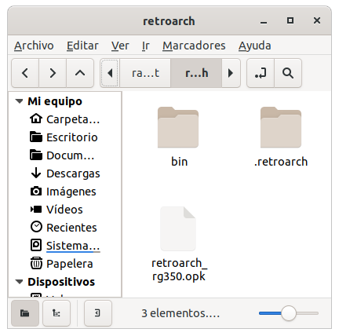
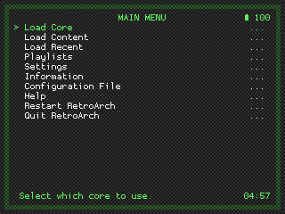
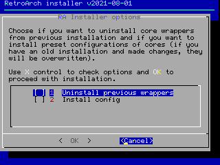

In December, official [RetroArch](https://www.retroarch.com/) distributions for RG350 and RG280 began to appear. Initially in the form of nightly builds that can be obtained from [this site](https://buildbot.libretro.com/nightly/dingux/mips32/) for stock/ROGUE or [this other](https://buildbot.libretro.com/nightly/dingux/mips32-odbeta/) for [ODBeta](http://od.abstraction.se/opendingux/latest/). Currently there are also stable distributions for [stock/ROGUE](https://buildbot.libretro.com/stable/1.9.6/dingux/mips32/RetroArch.7z) and [ODBeta](https://buildbot.libretro.com/stable/1.9.6/dingux/mips32-odbeta/RetroArch.7z).

Either in the stable version or in the nightly builds, the zip files that they distribute contain a single OPK, a binary and a directory (with the base configuration and cores) to be copied to the home of the system:



Once everything is in place, the only way to run the ROMs with the cores included in the distribution is through the only OPK that launches RetroArch as frontend (UX mode, like it is known in other emulators):



To achieve a more complete integration of RetroArch, respecting the normal experience of the usual frontends in RG350 / RG280 (GMenu2X, SimpleMenu, PyMenu, EmulationStation, etc.), wrapper-type OPKs can be created that allow selecting the ROMs and launching the corresponding RetroArch core, since the optional binary supports the same arguments as RetroArch on other platforms.

This repository is only intended to facilitate the installation of the RetroArch package for OpenDinux. The binaries included on the OPK releases, whose source code is in the [official RetroArch repository](https://github.com/libretro/RetroArch), have not been modified.

## OPK wrappers

To achieve this, it was first necessary to figure out how to parameterize the core and the ROM. Loading a core and a ROM from RetroArch itself does not work because it does not externalize this data as arguments on the executable. So I assumed that the same argument format used by the `retroarch_rg350` binary (inside `bin` directory; in ODBeta distribution, the binary is `retroarch_rg350_odbeta`) would serve on other systems like EmuELEC on RG351P. In this console the usual EmulationStation frontend does parameterize the core and the ROM to be executed by means of arguments in the call. For example, running Tetris on Game Boy with the core gambatte in EmuELEC on RG3551P, the process is invoked in this way:

```
/usr/bin/retroarch -v -L /tmp/cores/gambatte_libretro.so --config /storage/.config/retroarch/retroarch.cfg /storage/roms/gb/Tetris (World) (Rev A).7z
```

Therefore, the idea is, first, to install the `retroarch_rg350` optional binary in an accessible path (`/media/data/local/bin` is chosen), and then build different OPKs that invoke a script whith the ROM to be executed as argument. Inside the script we can mount the complete call to the `retroarch_rg350`. For example for the Game Boy system the script could be the following:

```bash
#!/bin/sh
/media/data/local/bin/retroarch_rg350 -v -L /media/data/local/home/.retroarch/cores/gambatte_libretro.so --config /media/data/local/home/.retroarch/retroarch.cfg "$1"
```

We put the previous script together with an appropriate icon for the system that is going to launch and a `.desktop` that invokes the script passing the ROM as an argument, for example:

```
[Desktop Entry]
Name=Nintendo GB (RA)
Comment=Nintendo GB in RetroArch
Exec=exec.sh %f
Terminal=false
Type=Application
StartupNotify=true
Icon=icon
Categories=retroarch;
X-OD-NeedsDownscaling=true
```

This are the cores offered by the latest version of RetroArch released at the time of writing (2021-07-04):

|Core|System|Supported extensions|Observations|
|:---|:-----|:-------------------|:-----------|
|dosbox_pure_libretro.so|DOSBox|zip, dosz, exe, com, bat, iso, cue, ins, img, ima, vhd, m3u, m3u8| |
|fbalpha2012_cps1_libretro.so|CPS1|zip| |
|fbalpha2012_cps2_libretro.so|CPS2|zip| |
|fbalpha2012_neogeo_libretro.so|Neo Geo|zip| |
|fceumm_libretro.so|Nintendo NES|fds, nes, unif, unf|Disk System need BIOS: `disksys.rom` (md5: `ca30b50f880eb660a320674ed365ef7a`)|
|gambatte_libretro.so|Nintendo GB/GBC|gb, gbc, dmg|Optional BIOS: `gb_bios.bin` (md5: `32fbbd84168d3482956eb3c5051637f5`), `gbc_bios.bin` (md5: `dbfce9db9deaa2567f6a84fde55f9680`)|
|genesis_plus_gx_libretro.so|SEGA MD, MS, GG, SEGA CD|mdx, md, smd, gen, bin, cue, iso, sms, bms, gg, sg, 68k, chd, m3u|SEGA CD need BIOS: `bios_CD_E.bin`, `bios_CD_U.bin`, `bios_CD_J.bin`|
|genesis_plus_gx_wide_libretro.so|SEGA MD, MS, GG, SEGA CD|mdx, md, smd, gen, bin, cue, iso, sms, bms, gg, sg, 68k, chd, m3u|SEGA CD need BIOS: `bios_CD_E.bin`, `bios_CD_U.bin`, `bios_CD_J.bin`|
|gpsp_libretro.so|Nintendo GBA|gba, bin|Optional BIOS: `gba_bios.bin` (md5: `a860e8c0b6d573d191e4ec7db1b1e4f6`)|
|handy_libretro.so|Atari Lynx|lnx, o|Need BIOS: `lynxboot.img` (md5: `fcd403db69f54290b51035d82f835e7b`)|
|mame2003_libretro.so|MAME2003|zip| |
|mame2003_plus_libretro.so|MAME2003+|zip| |
|mednafen_pce_fast_libretro.so|PC Engine, PC Engine CD|pce, cue, ccd, chd, toc, m3u|PCE CD need BIOS: `syscard3.pce` (md5: `38179df8f4ac870017db21ebcbf53114`)|
|mednafen_wswan_libretro.so|WonderSwan|ws, wsc, pc2| |
|mgba_libretro.so|Nintendo GBA|gb, gbc, gba|Optional BIOS: `gba_bios.bin` (md5: `a860e8c0b6d573d191e4ec7db1b1e4f6`)|
|mrboom_libretro.so|MrBoom| | |
|o2em_libretro.so|Magnavox Odyssey2, Phillips Videopac+|bin|Need BIOS: `o2rom.bin` (md5: `562d5ebf9e030a40d6fabfc2f33139fd`)|
|picodrive_libretro.so|SEGA MD, MS, SEGA CD, SEGA 32X|bin, gen, smd, md, 32x, chd, cue, iso, sms, 68k, m3u|SEGA CD need BIOS: `bios_CD_U.bin` (md5: `2efd74e3232ff260e371b99f84024f7f`), `bios_CD_E.bin` (md5: `e66fa1dc5820d254611fdcdba0662372`), `bios_CD_J.bin` (md5: `278a9397d192149e84e820ac621a8edd`)|
|pokemini_libretro.so|PokeMini|min|Need BIOS: `bios.min` (md5: `1e4fb124a3a886865acb574f388c803d`)|
|potator_libretro.so|Watara Supervision|bin, sv| |
|prboom_libretro.so|Doom|wad, iwad, pwad|Need game files|
|prosystem_libretro.so|Atari 7800|a78, bin|Optional BIOS: `7800 BIOS (U).rom` (md5: `0763f1ffb006ddbe32e52d497ee848ae`)|
|quicknes_libretro.so|Nintendo NES|nes| |
|race_libretro.so|Neo Geo Pocket|ngp, ngc, ngpc, npc| |
|scummvm_libretro.so|ScummVM|<see file in core_info>| |
|snes9x2005_libretro.so|Nintendo SNES|smc, fig, sfc, gd3, gd7, dx2, bsx, swc| |
|snes9x2005_plus_libretro.so|Nintendo SNES|smc, fig, sfc, gd3, gd7, dx2, bsx, swc| |
|stella2014_libretro.so|Atari 2600|a26, bin| |
|tic80_libretro.so|TIC-80|tic| |
|tyrquake_libretro.so|Quake|pak|Need game files|
|vice_x64_libretro.so|Commodore 64|d64, d71, d80, d81, d82, g64, g41, x64, t64, tap, prg, p00, crt, bin, zip, gz, d6z, d7z, d8z, g6z, g4z, x6z, cmd, m3u, vfl, vsf, nib, nbz, d2m, d4m| |

Additionally, the compilation of unofficial cores made by [Poligraf](https://github.com/Poligraf/opendingux_ra_cores_unofficial) is included (**WARNING**: this compilation is an experiment by its author; some cores like `hatari` and `puae` have not been tested; feedback is welcome). This involves adding the following cores to the former list:

|Core|System|Supported extensions|Observations|
|:---|:-----|:-------------------|:-----------|
|2048_libretro.so|[2048](https://en.wikipedia.org/wiki/2048_(video_game))| | |
|81_libretro.so|Sinclair ZX81|p, tzx, t81| |
|atari800_libretro.so|Atari 5200|xfd,atr,cdm,cas,bin,a52,zip,atx,car,com,xex|Needs BIOS to emulate Atari5200: `5200.rom` (md5: `281f20ea4320404ec820fb7ec0693b38`)|
|bk_libretro.so|Elektronika - BK-0010/BK-0011|bin|Needs BIOS (model `BK-0010`): `bk/BASIC10.ROM` (md5: `3fa774326d75410a065659aea80252f0`), `bk/FOCAL10.ROM` (md5: `5737f972e8638831ab71e9139abae052`), `bk/MONIT10.ROM` (md5: `95f8c41c6abf7640e35a6a03cecebd01`). Unsupported video mode on stock/ROGUE.|
|bluemsx_libretro.so|MSX, MSX2|rom,ri,mx1,mx2,col,dsk,cas,sg,sc,m3u|Needs BIOS in `.retroarch/system/Machines` directory|
|cannonball_libretro.so|SEGA Outrun|game, 88|Needs game files and a dummy file with the extension `.game`|
|cap32_libretro.so|Amstrad CPC|dsk, sna, zip, tap, cdt, voc, cpr, m3u| |
|crocods_libretro.so|Amstrad CPC|dsk,sna,kcr| |
|dinothawr_libretro.so|Dinothawr|game|Needs [game files](https://buildbot.libretro.com/assets/cores/Dinothawr/Dinothawr.zip)|
|fmsx_libretro.so|MSX, MSX2|rom,mx1,mx2,dsk,cas|Needs BIOS: `MSX.ROM` (md5: `364a1a579fe5cb8dba54519bcfcdac0d`), `MSX2.ROM` (md5: `ec3a01c91f24fbddcbcab0ad301bc9ef`), `MSX2EXT.ROM` (md5: `2183c2aff17cf4297bdb496de78c2e8a`), `MSX2P.ROM` (md5: `847cc025ffae665487940ff2639540e5`), `MSX2PEXT.ROM` (md5: `7c8243c71d8f143b2531f01afa6a05dc`). Unsupported video mode on RG280/ODBeta.|
|freechaf_libretro.so|Fairchild ChannelF|bin, chf|Needs BIOS: `sl31253.bin` (md5: `ac9804d4c0e9d07e33472e3726ed15c3`), `sl31254.bin` (md5: `da98f4bb3242ab80d76629021bb27585`), `sl90025.bin` (md5: `95d339631d867c8f1d15a5f2ec26069d`)|
|frodo_libretro.so|Commodore 64|d64,t64,x64,p00,lnx,zip| |
|fuse_libretro.so|Sinclair ZX Spectrum|tzx, tap, z80, rzx, scl, trd, dsk| |
|gme_libretro.so|Game Music Emu|ay, gbs, gym, hes, kss, nsf, nsfe, sap, spc, vgm, vgz, zip| |
|gw_libretro.so|Nintendo Game&Watch|mgw|Unsupported video mode in some games on stock/ROGUE, but pressing keys sometimes they run|
|hatari_libretro.so|Atari ST|st, msa, zip, stx, dim, ipf, m3u|Needs BIOS: `tos.img` (md5: `c1c57ce48e8ee4135885cee9e63a68a2`). Difficult configuration because of unsupported video mode. Achieved some success with ODBeta, but not with stock/ROGUE.|
|lowresnx_libretro.so|LowRes NX|nx| |
|mednafen_vb_libretro.so|Nintendo Virtual Boy|vb, vboy, bin|Poor performance|
|mu_libretro.so|Palm|prc,pqa,img|Needs BIOS: `palmos41-en-m515.rom` (md5: `83cb1d1c76e568b916dc2e7c0bf669f6`). Needs a stick to manage the stylus, so doesn't run on RG280V.|
|nekop2_libretro.so|NEC PC-98|d98,zip,98d,fdi,fdd,2hd,tfd,d88,88d,hdm,xdf,dup,cmd,hdi,thd,nhd,hdd|I couldn't get it to work. May be it [needs some BIOS](https://docs.libretro.com/library/neko_project_ii_kai/#bios).|
|nxengine_libretro.so|Cave Story|exe|Needs game files|
|pcsx_rearmed_libretro.so|PlayStation|bin,cue,img,mdf,pbp,toc,cbn,m3u,ccd,chd|Poor performance.|
|[pocketcdg_libretro.so](https://docs.libretro.com/library/pocketcdg/)|PocketCDG|cdg| |
|puae_libretro.so|Commodore Amiga|adf, adz, dms, fdi, ipf, hdf, hdz, lha, slave, info, cue, ccd, nrg, mds, iso, chd, uae, m3u, zip, 7z|Needs BIOS: `kick34005.A500` (md5: `82a21c1890cae844b3df741f2762d48d`)|
|quasi88_libretro.so|NEC PC-88|d88,u88,m3u|Needs BIOS: `quasi88/n88.rom`, `quasi88/n88_0.rom`|
|reminiscence_libretro.so|Flashback|map, aba, seq, lev|Needs game files. I couldn't get it to work.|
|stonesoup_libretro.so|Dungeon Crawl Stone Soup|crawlrc|Needs [game files](https://github.com/libretro/crawl-ref/tree/master/crawl-ref/source/dat) and an empty file `game.crawlrc` (instructions [here](https://docs.libretro.com/library/stone_soup/#how-to-start-the-dungeon-crawl-stone-soup-core)). Unsupported video mode on RG280/stock/ROGUE, reboots on beta.|
|theodore_libretro.so|Thomson - MO/TO|fd, sap, k7, m7, m5, rom|Difficult configuration because of unsupported video mode. Achieved some success with MO5 model on ODBeta, but not on stock/ROGUE.|
|uzem_libretro.so|Uzebox|uze|Poor performance|
|vecx_libretro.so|Vectrex|bin,vec| |
|x1_libretro.so|Sharp X1|dx1,zip,2d,2hd,tfd,d88,88d,hdm,xdf,dup,tap,cmd|Needs BIOS: `xmil/IPLROM.X1` (md5: `eeeea1cd29c6e0e8b094790ae969bfa7`), `xmil/IPLROM.X1T` (md5: `851e4a5936f17d13f8c39a980cf00d77`)|

Therefore, we have to make one OPK at least for each of them. We say *at least* because the option of making an OPK for each "core/system to emulate" combination can be considered.

## Installer

As there are several pieces necessary for the set to work, an installer has been created to install everything you need in one go. Specifically, the installer integrates this items:

* 37+31 (official+unofficial) OPKs to launch the different core/system combinations independently from different frontends (GMenu2X, SimpleMenu, PyMenu, EmulationStation, etc.) by previously selecting the ROM (Explorer mode).
* Binary `retroarch_rg350` (or `retroarch_rg350_odbeta` for ODBeta) in common location (`/media/data/local/bin`) to be invoked by former OPKs to not be cloned inside them.
* Configurations for all the cores differentiated by screen, that is, adequate configurations for 320x240 or 640x480 are installed depending on the screen detected. The settings have been adopted from the Retro Game Corps recommendations in [this guide](https://retrogamecorps.com/2020/12/24/guide-retroarch-on-rg350-and-rg280-devices/).
* GMenu2X filters by extension for each system (including `7z` in all systems).
* New section with the RetroArch icon in all the skins installed in GMenu2X where all the OPK launchers appear.

When launched, it ask for two options that are disabled by default:



* Install config: To install the configurations refered in third spot in last list. The recommendation is to install the configurations the first time and not install them in subsequent installations to avoid losing the settings made on it.
* Install unofficial cores: To install the 31 new but unofficial cores of [Poligraf](https://github.com/Poligraf/opendingux_ra_cores_unofficial).

The OPK with the installer can be obtained in the releases of [this repository](https://github.com/eduardofilo/RG350_ra_installer/releases/latest).

## Hoykeys

In RetroArch configuration file the following hotkeys have been defined.

|Function|Shortcut|
|:-------|:-------|
|Pause|`Select + A`|
|Reset|`Select + B`|
|RetroArch Menu|`Select + X`|
|Fast forward|`Select + Y`|
|Savestate save|`Select + R1`|
|Savestate load|`Select + L1`|
|Swap disk|`Select + R2`|
|Open CD tray|`Select + L2`|
|Close content|`Select + Start`|
|Savestate slot changing|`Select + ←→`|
|Volume changing|`Select + ↑↓`|

## Telegram channel

Join this Telegram channel to get update notifications: [https://t.me/RG350_ra_installer](https://t.me/RG350_ra_installer)

## Requerimientos

* Linux
* git 7z
